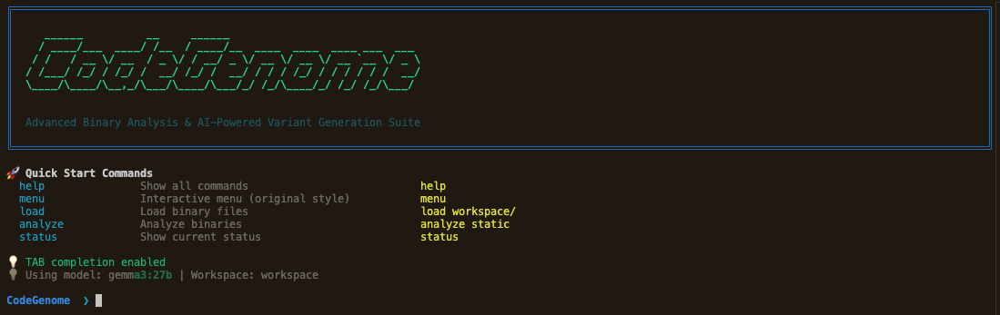

# CodeGenome Suite



**AI-Powered Code Variant Generation with Advanced Binary Analysis**

CodeGenome is a sophisticated system that generates functionally equivalent C code variants with different binary signatures. Using advanced AI transformation strategies and metamorphic techniques, it creates diverse program variants while maintaining identical functionality, making it invaluable for binary analysis research, reverse engineering studies, and software testing scenarios.

> ### ⚠️ Important Notice
>
> **Note on Development Status**
>
> CodeGenome is an experimental project in active development. We encourage you to use it, test it, and contribute to its growth. However, please be aware that it may contain bugs or undergo significant changes. Your contributions via issues and pull requests are highly welcome.
>
> **Disclaimer and Responsible Use**
>
> This software is intended for educational, research, and defensive security purposes only. The authors do not condone any malicious use of this tool. Any actions you take using CodeGenome are your own responsibility. By using this software, you agree to do so in a manner that complies with all applicable laws and regulations and to adhere to the terms outlined in the `LICENSE` file.

## 📚 Table of Contents

- [✨ Features](#-features)
- [🏗️ Architecture](#️-architecture)
- [🔑 Key Files](#-key-files)
- [🚀 Getting Started](#-getting-started)
- [🔧 Configuration](#-configuration)
- [📖 Workflow Examples](#-workflow-examples)
- [📁 Output Structure](#-output-structure)
- [🔧 Advanced Configuration](#-advanced-configuration)
- [🎯 Use Cases](#-use-cases)
- [🤝 Contributing](#-contributing)
- [📜 Citation](#-citation)
- [📄 License](#-license)
- [🙏 Acknowledgments](#-acknowledgments)

## ✨ Features

### 🤖 AI-Powered Variant Generation
- **Advanced Transformation Strategies**: Leverages AI-driven strategies to maximize binary differentiation. These strategies include altering control flow, data types , and algorithmic structure.
- **LLM-Based Code Restructuring**: Utilizes Large Language Models via Ollama (e.g., `gemma3:27b`) to perform complex, semantics-preserving code transformations that go beyond simple pattern replacement.
- **Intelligent Prompt Engineering**: Employs a  prompt templating system (`AI_PROMPT_TEMPLATE`) that instructs the LLM to maintain functional equivalence while diversifying code patterns, variable names, and mathematical expressions.
- **Automated Test Suite Generation**: Analyzes the source code to automatically generate a suite of test cases (`test_cases.json`) and a Python-based test runner (`test_runner.py`) to rigorously validate the functional correctness of each generated variant.
- **Performance & Metrics Logging**: Monitors the LLM's performance, tracking metrics like generation time, token usage, and success rates. This data is logged to both JSON and CSV files (`ai_generation_metrics.json`, `ai_generation_metrics.csv`) for analysis.

### 📊 Advanced Binary Analysis
- **Multi-Tool Static & Dynamic Analysis**: Integrates `radare2` for deep static analysis of binary properties (e.g., function size, cyclomatic complexity, entropy) and `strace` for dynamic analysis of system call patterns during execution.
- **Comparative Radar Chart Visualizations**: Generates intuitive radar charts to visually compare key metrics across multiple binaries, providing a clear overview of their structural and behavioral differences.
- **System Call Pattern Analysis**: Captures and analyzes syscall sequences using n-gram modeling to identify unique behavioral fingerprints, which are crucial for detecting subtle functional deviations.
- **Feature-Based Distance Matrices**: Calculates and exports Euclidean and Cosine similarity matrices based on a vector of binary features, offering a quantitative measure of how "different" the variants are from each other.
- **Interactive Binary Management**: Provides a CLI-based interface for selecting, grouping, and managing binaries for analysis, with smart categorization based on their origin (AI-generated, MetaME-transformed, or original).

### 🔬 MetaME Integration
- **Metamorphic Binary Transformation**: Directly manipulates compiled executables using the MetaME engine to apply a series of semantic-preserving transformations at the binary level.
- **Configurable Transformation Passes**: Allows for the configuration of specific transformation passes within MetaME, such as instruction substitution, register reassignment, and code transposition, to complement the source-level changes made by the AI.

### 🖥️ Modern CLI Interface
- **Unified & Interactive Workflow**: A single, powerful CLI (`codegenome_cli.py`) manages the entire workflow, from loading source/binary files to generation, analysis, and results visualization.
- **Intelligent Path Completion**: Features shell-like tab completion for file paths and commands, significantly speeding up user interaction.
- **Real-Time Status Feedback**: Uses rich formatting and status indicators to provide clear, real-time feedback on ongoing processes like AI generation or binary analysis.

### ✅ Validation & Testing
- **Automated Functional Equivalence Verification**: For each generated variant, the system compiles the code and runs the auto-generated test suite against it, comparing the output against the original program's output to ensure correctness.
- **Standalone Test Runners**: Each test suite is self-contained and includes a dedicated runner, allowing for easy, independent verification or manual testing of any variant outside the CodeGenome suite.

## 🏗️ Architecture

```
CodeGenome Suite Architecture:

┌─────────────────────────────────────────────────────────────┐
│                    CLI Interface Layer                      │
│  ┌─────────────────┐  ┌─────────────────┐                  │
│  │ codegenome_cli  │  │ Terminal UI     │                  │
│  │ (Modern CLI)    │  │ (Interactive)   │                  │
│  └─────────────────┘  └─────────────────┘                  │
└─────────────────────────────────────────────────────────────┘
                              │
┌─────────────────────────────────────────────────────────────┐
│                    Core Application Layer                   │
│  ┌─────────────────┐  ┌─────────────────┐                  │
│  │ codegenome_core │  │ AgenticLLM      │                  │
│  │ (Main Logic)    │  │ (AI Agent)      │                  │
│  └─────────────────┘  └─────────────────┘                  │
└─────────────────────────────────────────────────────────────┘
                              │
┌─────────────────────────────────────────────────────────────┐
│                    Generation Engines                       │
│  ┌─────────────────┐  ┌─────────────────┐                  │
│  │ ai_engine       │  │ MetaME          │                  │
│  │ (AI Variants)   │  │ (Binary Morphs) │                  │
│  └─────────────────┘  └─────────────────┘                  │
└─────────────────────────────────────────────────────────────┘
                              │
┌─────────────────────────────────────────────────────────────┐
│                    Analysis & Validation                    │
│  ┌─────────────────┐  ┌─────────────────┐                  │
│  │ advanced_binary │  │ Test Suites     │                  │
│  │ _analyzer       │  │ (Validation)    │                  │
│  └─────────────────┘  └─────────────────┘                  │
└─────────────────────────────────────────────────────────────┘
```

## 🔑 Key Files

### Core Components
- **`codegenome_cli.py`** - Modern CLI interface with tab completion and unified file handling
- **`ai_engine.py`** - Enhanced AI transformation engine with 6 strategic approaches
- **`advanced_binary_analyzer.py`** - Comprehensive binary analysis with radar charts and metrics
- **`codegenome_core.py`** - Core application logic and terminal interface management
- **`config.py`** - Unified configuration system with well-documented settings

### Configuration & Data
- **`config.toml`** - Single configuration file for all system settings
- **`requirements.txt`** - Python dependencies and package versions
- **`workspace/`** - Generated variants, test suites, and analysis results
- **`source_code/`** - Sample C programs for testing and demonstration

## 🚀 Getting Started

This guide will walk you through setting up the CodeGenome Suite and running it for the first time.

### Prerequisites

#### System Requirements
Ensure you have the essential development tools installed.

```bash
# For Ubuntu/Debian-based systems
sudo apt update
sudo apt install build-essential gcc git python3 python3-pip
```

#### Python Dependencies
Install the required Python packages using pip.

```bash
pip install -r requirements.txt
```

### For Making MetaME Work (Optional)

MetaME enables binary-level transformations and requires a specific version of `radare2`. If you don't need this feature, you can skip this step.

#### Prerequisites for radare2
```bash
# Add 32-bit architecture support
sudo dpkg --add-architecture i386
sudo apt update

# Install development tools and multilib support
sudo apt install build-essential git
sudo apt install libc6-dev-i386 gcc-multilib g++-multilib
```

#### Install Specific radare2 Version
```bash
# Clone, checkout the specific commit, and install
git clone https://github.com/radareorg/radare2.git
cd radare2
git checkout 41dc7e6db6932ebca90a9bc66ee58ee845880fee
sudo sys/install.sh
cd ..
```
This specific commit (`41dc7e6db6932ebca90a9bc66ee58ee845880fee`) is crucial for MetaME compatibility.

### Getting Started: First Run

#### 1. Setup Ollama & Pull AI Model
CodeGenome uses Ollama to run the AI models locally. First, install Ollama and ensure the service is running.

```bash
# Install Ollama (if you haven't already)
curl -fsSL https://ollama.ai/install.sh | sh

# Start the Ollama service in the background
ollama serve &

# Pull the recommended model for a balance of performance and quality
ollama pull gemma3:12b
```
For faster generation on less powerful hardware, you can pull a smaller model (`ollama pull gemma3:1b`), but be sure to update the `LLM_MODEL` in `config.py`.

#### 2. Launch the CodeGenome CLI
With the prerequisites installed and the AI model ready, you can now start the application.

```bash
python3 codegenome_cli.py
```

You will be greeted by the CodeGenome prompt (`CodeGenome ❯`).

#### 3. Your First Generation & Analysis
From the CLI, you can load a source file, generate AI variants, and analyze the results.

```bash
# Load a sample C source file
CodeGenome ❯ load source_code/hello_world.c

# Generate 2 AI variants from the loaded file
CodeGenome [📄1] ❯ ai
Number of AI variants to generate: 2

# Analyze the generated binaries to see how they differ
CodeGenome [📄1 🤖2] ❯ analyze
```
The suite will guide you through selecting binaries for analysis and will output the results in the `workspace/analysis_results/` directory.

## 🔧 Configuration

Configuration is managed in the `config.py` file, which is designed to be simple and easy to modify. Below is a breakdown of the key sections and settings you can customize.

#### LLM Configuration
This section controls the behavior of the AI model.

```python
# Which LLM model to use for code generation
LLM_MODEL = "gemma3:27b"          # Main model (gemma3:12b recommended)
LLM_FALLBACK_MODEL = "gemma3:1b"  # Faster fallback model
LLM_BASE_URL = "http://localhost:11434"  # Ollama server URL

# LLM generation parameters - adjust for creativity vs consistency
LLM_TEMPERATURE = 0.4      # Lower = more consistent, Higher = more creative (0.0-1.0)
LLM_TIMEOUT = 45           # Seconds to wait for LLM response
LLM_MAX_RETRIES = 3        # How many times to retry on failure
```

- `LLM_MODEL`: The primary Ollama model for generating code variants.
- `LLM_FALLBACK_MODEL`: A smaller, faster model to use if the primary one fails.
- `LLM_BASE_URL`: The URL of your running Ollama instance.
- `LLM_TEMPERATURE`: Controls the creativity of the AI. Lower values produce more predictable code, while higher values result in more diverse and creative outputs.
- `LLM_TIMEOUT`: The maximum time to wait for a response from the model.
- `LLM_MAX_RETRIES`: The number of times to retry if the model fails to generate a valid response.

#### AI Prompts
This section allows you to customize the instructions given to the AI for transforming code.

```python
# Main prompt template
AI_PROMPT_TEMPLATE = """Transform this C code with {focus} while keeping EXACT same output:

{source_code}

Requirements:
- Identical output and behavior
- Different variable names
- Different loop types  
- Compilable C code

Transformed code:"""

# Different transformation focuses for variants
AI_VARIANT_1_FOCUS = "Change for→while loops, int→long variables, rename all variables"
AI_VARIANT_2_FOCUS = "Use backward iteration, arrays instead of scalars, different math"
AI_VARIANT_3_FOCUS = "Recursive approach, helper functions, reorganize computation"
```

- `AI_PROMPT_TEMPLATE`: The main template used to instruct the AI. You can modify the requirements to guide the transformation process.
- `AI_VARIANT_FOCUS`: These variables define different transformation strategies. The text provided here will be inserted into the `{focus}` placeholder in the main prompt.

#### Testing Configuration
These settings control the automated test generation and validation process.

```python
# Test generation settings
TESTING_ENABLED = True           # Enable test generation and validation
MAX_TEST_CASES = 20              # Maximum test cases per variant
MIN_TEST_CASES = 4               # Minimum test cases per variant
TEST_TIMEOUT = 10                # Seconds per test execution
```

- `TESTING_ENABLED`: A master switch to turn test generation on or off.
- `MAX_TEST_CASES` / `MIN_TEST_CASES`: The range for how many test cases the AI should generate for each variant.
- `TEST_TIMEOUT`: The maximum time allowed for a single test case to run.

#### Workspace and Files
This section defines the directory structure for inputs and outputs.

```python
# Directory structure
WORKSPACE_DIR = "workspace"                    # Main workspace directory
SOURCE_CODE_DIR = "source_code"              # Where to find source files
TEST_SUITES_DIR = "workspace/test_suites"    # Generated test suites
METRICS_DIR = "workspace/llm_metrics"        # Performance metrics
```

#### Binary Analysis
Configure the tools and settings for analyzing the generated binaries.

```python
# Analysis tools (set to False if not installed)
USE_RADARE2 = True              # Use radare2 for binary analysis
USE_STRACE = True               # Use strace for syscall tracing
ENABLE_DYNAMIC_ANALYSIS = False # Enable dynamic analysis (requires strace)

# Analysis settings
STRACE_TIMEOUT = 30             # Seconds for strace execution
GENERATE_RADAR_CHARTS = True    # Create visual comparison charts
```

- `USE_RADARE2` / `USE_STRACE`: Enable or disable specific analysis tools.
- `ENABLE_DYNAMIC_ANALYSIS`: A master switch for dynamic analysis, which relies on `strace`.
- `GENERATE_RADAR_CHARTS`: If enabled, the suite will generate radar charts to visualize the differences between binaries.

## 📖 Workflow Examples

### AI Variant Generation
```bash
# Load a C source file
CodeGenome ❯ load myprogram.c

# Generate multiple variants with different strategies
CodeGenome [📄1] ❯ ai
Number of AI variants to generate: 3

# Results: 3 functionally equivalent variants with different binary signatures
```

### Binary Analysis
```bash
# Load existing binaries or use generated variants
CodeGenome ❯ load workspace/

# Analyze all loaded binaries
CodeGenome [🎯5] ❯ analyze
# Select binaries for comparison
# Results: Radar charts, similarity matrices, detailed reports
```

### MetaME Transformations
```bash
# Load compiled binaries
CodeGenome ❯ load binaries/

# Generate metamorphic variants
CodeGenome [🎯3] ❯ metame
# Results: Binary-level transformed variants
```

## 📁 Output Structure

```
workspace/
├── variants/                     # Generated code variants
│   ├── program_ai_v01.c
│   ├── program_ai_v02.c
│   └── program_ai_v03.c
├── test_suites/                  # Validation test suites
│   ├── program_ai_v01/
│   │   ├── test_cases.json
│   │   ├── test_runner.py
│   │   └── README.md
├── analysis_results/             # Binary analysis reports
│   ├── radar_comparison.png
│   ├── analysis_report.json
│   └── distance_matrix.csv
└── llm_metrics/                  # Performance metrics
    ├── ai_generation_metrics.csv
    └── ai_generation_metrics.json
```

## 🔧 Advanced Configuration

### LLM Prompt Customization
Modify the AI transformation prompts in `ai_engine.py`:

```python
# Example from ai_engine.py
def _get_transformation_prompt(self, source_code: str, strategy: str) -> str:
    # ...
    prompts = {
        "obfuscate": "Obfuscate this C code...",
        # ...
    }
```

### Analysis Tool Configuration
```toml
# From config.toml
[analysis]
enable_dynamic = true
enable_static = true
generate_reports = true
```

## 🎯 Use Cases

### Research Applications
- **Advanced Binary Analysis**: Generate a corpus of functionally identical but structurally diverse binaries to study the impact of source-level changes on low-level characteristics. Researchers can measure metrics like **function-level entropy**, **control flow graph (CFG) complexity**, and **instruction set distribution** to develop more robust heuristics for binary analysis tools.
- **Reverse Engineering Tool Development**: Create diverse binary samples to train and validate machine learning models for tasks such as **function boundary detection**, **code similarity (diffing)**, and **compiler provenance identification**. The generated variants serve as a controlled dataset for evaluating the accuracy and resilience of reverse engineering algorithms.
- **Malware Evasion and Detection**: Simulate polymorphic and metamorphic malware by generating variants that evade signature-based detection. This allows security researchers to test the effectiveness of **antivirus engines**, **intrusion detection systems (IDS)**, and **sandboxing technologies** against evolving threats.

### Software Testing & Verification
- **Compiler Fuzzing and Validation**: Systematically generate a wide array of source-code variants to test the correctness and stability of compilers (e.g., GCC, Clang). By compiling thousands of equivalent programs with different optimization flags (`-O1`, `-O2`, `-Os`), developers can uncover bugs in compiler optimization passes or code generation stages.
- **Performance Regression Testing**: Analyze the performance trade-offs of different algorithmic implementations. By generating variants that use different loops, data structures, or memory access patterns, developers can compare execution characteristics like **CPU cycles**, **cache misses**, and **system call frequency** to identify and prevent performance regressions.
- **Cross-Platform Behavior Analysis**: Verify that a program behaves consistently across different architectures (e.g., x86-64 vs. AArch64) or operating systems. Generating variants helps stress-test the toolchain and runtime environment, ensuring that subtle code changes do not lead to unexpected, platform-specific bugs.

### Educational Purposes
- **Low-Level Code Comprehension**: Provide students with concrete examples of how high-level language constructs (e.g., loops, recursion, data structures) are translated into low-level assembly code. By comparing the binaries of different variants, learners can build a deeper intuition for the compilation process.
- **Practical Algorithm Analysis**: Visually and quantitatively demonstrate the trade-offs between different algorithmic approaches to solving the same problem. Students can analyze the generated variants to see how they differ in terms of **binary size**, **execution speed**, and **memory consumption**.
- **Cybersecurity Training**: Illustrate the principles of code obfuscation, polymorphism, and software protection. The suite can be used in cybersecurity courses to create hands-on labs where students learn to analyze and reverse-engineer obfuscated code.

## 🤝 Contributing

We welcome contributions to improve CodeGenome! Areas where you can help:

- **New Transformation Strategies** - Implement additional AI transformation approaches
- **Analysis Tools Integration** - Add support for more binary analysis tools
- **Performance Optimizations** - Improve generation speed and efficiency
- **Documentation** - Enhance guides, examples, and API documentation
- **Platform Support** - Extend compatibility to additional operating systems
- **UI/UX Improvements** - Enhance the CLI interface and user experience

### How to Contribute
1. Fork the repository
2. Create a feature branch (`git checkout -b feature/AmazingFeature`)
3. Commit your changes (`git commit -m 'Add some AmazingFeature'`)
4. Push to the branch (`git push origin feature/AmazingFeature`)
5. Open a Pull Request

## 📜 Citation

If you use CodeGenome in your research or projects, please cite:

```bibtex
@software{codegenome_suite,
  title={CodeGenome: AI-Powered Code Variant Generation with Advanced Binary Analysis},
  author={Your Name},
  year={2024},
  url={https://github.com/yourusername/CodeGenome},
  note={AI-powered system for generating functionally equivalent code variants}
}
```

## 📄 License

This project is licensed under the MIT License - see the `LICENSE` file for details.

## 🙏 Acknowledgments

- **Ollama Team** for providing the LLM infrastructure
- **radare2 Project** for comprehensive binary analysis capabilities
- **MetaME Developers** for metamorphic transformation engine
- **Rich Library** for beautiful terminal interfaces
- **Open Source Community** for the foundational tools and libraries

---

**CodeGenome Suite** - Pushing the boundaries of automated code variant generation and binary analysis research.
